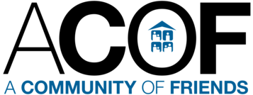

# A Community of Friends: Specialty Programs Website
**Team Members:** Jeffrey Tam, Hugo Romero Flores, Hanson Liew 
**Faculty/Thesis Advisor:** Dr. Jose Ortiz

## Project Documentation
- [Site Narrative](https://docs.google.com/document/d/1f73aA8GOSWeRItQjlrbDRrdIr4XeAVUH9LCmNYno9DA/edit?usp=sharing)

- [Wireframe](https://www.figma.com/proto/dHkmAvnTFz94JSMtDZ0xw0/CIS-3610-01--ACOF-Website-Design---Team-6?node-id=1-2&p=f&t=hCKjix9FO4AQyBax-1&scaling=min-zoom&content-scaling=fixed&page-id=0%3A1)

- [Mockup](https://www.figma.com/proto/dHkmAvnTFz94JSMtDZ0xw0/CIS-3610-01--ACOF-Website-Design---Team-6?node-id=855-1118&p=f&t=t5GkLpugHuyfuvl9-0&scaling=min-zoom&content-scaling=fixed&page-id=22%3A2)

## About ACOF:

"A Community of Friends (ACOF) is a 501(c)(3) organization that develops, owns, and manages affordable rental housing, with the mission of ending homelessness through the provision of quality Permanent Supportive Housing (PSH) for people with mental illness. Guided by the Housing First approach, ACOF ensures that people experiencing chronic homelessness are offered immediate access to safe, stable housing without preconditions. From there, we deliver integrated support services that promote long-term stability, wellness, and personal growth—creating a foundation for individuals and families to rebuild their lives with dignity and purpose."

## Objective & Purpose
ACOF's current website provides general information about its services, and there is a need to enhance its online presence by showcasing its specialty programs in greater detail. Therefore, the objective and purpose of this project is to develop a new specialty programs website that will serve as a platform to promote the following programs *with the help of AI-generated content (AIGC)*:

1. Children's Program
- Offers activities for after-school enrichment.
- Supports children in overcoming trauma.
- Engages children in various forms of artistic expression, such as music, beyond traditional visual arts.

2. Health and Housing
- Provides healthcare services to adults, including dentistry and flu vaccinations.

3. Professional Development
- Provides comprehensive job preparation and life skill training
- Provides linkage to vocational training programs, Work Sources, and Ticket to Work
- Provides linkage to educational institutions
- Provide employment resources
- Involves volunteer positions to support tenants in increasing job skills
- Nurture interpersonal relationships 
- Establish collaborative relationships with other social service agencies
- Build community ties

Moreover, to align with the recent developments and the increased use of Artificial Intelligence (AI), as a part of his Honors College Thesis Project, **Jeffrey Tam**, guided by his thesis advisor, **Dr. Jose Ortiz**, has taken on this research to demonstrate the viability and business use case of how AI can contribute to website development for nonprofits like ACOF.

## Jeffrey's Honors College Thesis
**Thesis Title:** Business Perspectives on the Latest Trends in Artificial Intelligence: Content and Design Development for Nonprofit Websites with Generative Artificial Intelligence

**Abstract:** 
The rise in artificial intelligence in recent years has generated significant renewed interest and accelerated development as new models and abilities are developed and tested. Nonprofit organizations struggle to maintain a competitive digital presence due to limited resources, technical expertise, and the high costs of content creation. AI-generated content (AIGC) presents a potential solution, yet nonprofits may still find it challenging to implement. This thesis examines how nonprofits, like A Community of Friends (ACOF), can leverage prompt engineering strategies to optimize AI-generated content to be accurate, relevant, and aligned with their business goals. Through experimental testing of prompt engineering techniques, a consideration of the sociotechnical aspects of AI use, and applying insights from existing literature on AI adoption, a strategy will be developed to aid nonprofits in integrating AIGC to help gain a competitive advantage. Ultimately, as the findings suggest, structured and well-written prompts significantly improve AI output quality, allowing nonprofits a new opportunity to compete against large businesses despite their existing limitations. Therefore, in the business context—particularly for nonprofits—the development of a strategy for prompt engineering could be significantly beneficial for the creation of websites with AI-generated content to push forward and enhance their abilities to promote their initiatives. 

